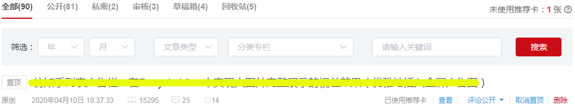
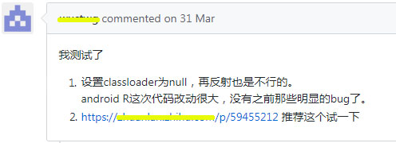
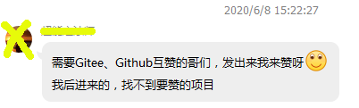
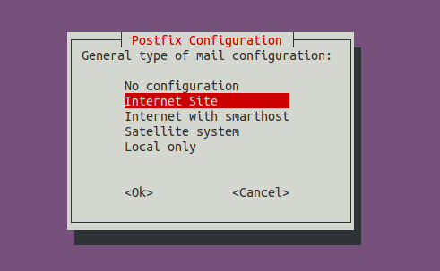

# 面试大厂没有开源项目？如何打造一个优秀的GitHub开源项目

GitHub现在已经成了日常开发中必不可少的网站，日常工作和学习中要用到好多上面的开源项目，评价项目质量好坏的一个重要标准就是看Star和Fork的数量，如果看到个Star超过100以上的，基本上这个项目是靠谱的，如果超过1000过，那已经算是很流行了，至于一万以上的，基本上都是如雷贯耳的存在了。

酒香还怕巷子深？如果你有一个很好的项目，还怕没人去发现、去关注吗？确实如此。一个优秀的开源项目，如果长时间得不到有效的宣传，它很有可能会永远默默无闻。比如，你有一个非常好用自定义组件，刚发出来就算别人能搜到了也不敢用，因为没有star，也就意味着没人用过，然而可能同类型的项目已经5,6年前没有维护了，star数量去有成百上千，但是他们凭借着数量的优势死死地压在你头上，所以你此时感到很气。

要想打造一个优秀的开源项目，不仅需要项目本身具有实用性和作者良好的编程功底，还需要做好宣传推广工作。

优秀的开源项目也是需要不断打磨的，宣传推广工作做好了，得到了众多关注，就会有人提`Issue`，这不仅可以发现项目中的bug，也促进了项目的优化。

本文重点介绍如何让你的GitHub项目快速增加star。

## 一，项目
首先，你需要一个项目，并不是每个人都能想到一个实用的项目（比如下载助手，刷票脚本等），如果抱着“条件主义”的态度，一直在想要做什么？要怎么实现？那就是一直在原地踏步，不会有任何进展。

因此可以从一些用过项目入手，比如Android开发中，我们在项目中用到了哪个开源框架，这个框架很好就是有某些缺陷，那就可以抓住这点，“站在巨人的肩膀上”，开发一个新的框架，然后要突出你的优势，把优势尽量放大。

或者找一下star比较多，但是已经很久不维护的项目，这种项目一般都会有很多Issue,可以根据这些Issue进行改性，适配新版本，或者简单点给它升级到AndroidX，或者改成kotlin版本，或者加入协程等等，都可以作为你的切入点。

其次，需要要写好readme。readme要简介明了，并能突出亮点，让新手一看就知道怎么用，最后还要附上效果图，一个好的效果图不仅让用户知道你项目的效果是怎样的，能否满足他们的需求，更能一下子吸引住用户。如果没有效果图会给人两眼一摸黑儿的感觉，不知道你这东西到底是干啥的。


## 二，推广

**1，写博客**

在`csdn` `掘金` `简书`等平台写文章，具体这么写我就不说了，这里简单说一下如何通过标题吸引用户。

一个好的标题可以这个改：

- 什么是进程和线程？ =>  写给大忙人看的进程和线程
- 商平台商品模块业务详解  => 亿级流量电商平台商品模块业务与技术详解实战
- Java 11 新特性  =>   最通俗易懂的 Java 11 新特性讲解
- Java中的变量与常量  =>   一篇文章快速搞懂 Java 变量与常量
- C++ 数组相关知识小结  =>   关于 C++ 数组，你该了解这些
- 图解 numpy.meshgrid()的含义 =>   我用一张图彻底理解了numpy.meshgrid()的含义

不要说什么标题党不标题党，能吸粉就完了。最后别忘了加上自己的项目地址。

csdn的“推荐卡”，掘金的“推荐”，简书的“专题”等可大大提高曝光率。

如下csdn的推荐效果：




**2，相关社区推广**

比如我们做安卓开发的都知道张鸿洋, 郭霖，任玉刚等大佬。他们的公众号、网站等平台不仅非常火热，而且是专注于安卓开发方向的社区，粉丝们大都是做安卓开发的，因此在他们平台投文章、提交项目能得到更过的曝光机会。

**3，评论式推广**

评论式推广就是在相关平台按照关键字搜索相关的问题、问题等，对其进行评论或回复，比如说你这个需求用某某组件可以完美实现，可以试试，然后留个GitHub链接。这种方式简单有效，短期内给被评论的提供了曝光机会，长期来说对遇到相同问题的人提供了曝光机会。如下所示：




相关的平台包括

- `StackOverflow`回复问题，附上链接。
-  `GitHub` 可以在类似项目的Issue中，回复当前项目存在的不足，你的项目有什么优势等。 
- `csdn` ，`简书`， `掘金`， `知乎专栏`，`知乎问答` 等平台的相关项目或问答中回复。


## 三，互水

互水说白了也就是互赞，当你第一次看到“互赞”时，你可能会想：What? 还有这种东西。

这里不推荐你进那些互赞群，互赞群主要有如下弊端：

1. **繁琐**

   每次看到别人的链接时你需要点开看看有没有赞过，没赞过就点赞，然后截图，@对方，附上你的仓库链接。别人看到后再回给你。

2. **低效**

   比如你想让别人赞你的项目，你在群聊中发出你的链接，一旦你的链接被新来的消息挤走，你就需要重新发一下你的链接。因此效率非常低下。

3. **不公平**

   有时候你已经和某人互相点赞了，但后来他又发了一个仓库地址出来，你一看没赞，于是立马点赞并切图通知对方并附上你的仓库地址，而对方给你的答复却是已经点赞了，此时你却发现你的star数量并没有增加，于是感到很纳闷。简单来说你在不知情的情况下给人赞了两个仓库，而别人只有一个账号给你点赞。

4. **不诚信**

   主要是有些人互相点赞后觉得自己账号点赞太多，会给人取消点赞，此时被取消点赞的你却不知道是谁取消点赞了。

由于所有互赞操作的发生都需要有人发出自己的项目，因此刚进群的伙伴很有可能遇到如下尴尬的情况：



结论：这种方式效率太低了，不推荐大家使用。


## 四，自己动手丰衣足食

如果你有急切的需求，比如最近几天就要去面试，想要快速增星，或者觉得互赞群操作比较麻烦，可以自己动手操作。

那么怎么自己动手呢？假如你有一个云服务器，同时有一个域名，此时你可以搭建一个邮件服务器，一个域名对应无限多个二级域名，那么你就有无限多个邮箱地址。有了这么多邮箱你就可以去注册很多个账号，有了这些账号你就实现了自给自足。

所以这里主要说一下如何搭建邮件服务器。

**1，解封25端口**

一般我们买的云服务器的25端口默认是关闭的，但是可以在后台申请解封。如下是腾讯云解封操作：


同时还需要在安全组里打开25端口。

我们的目的是接收邮件，所以一般不去大量发送垃圾邮件就不会有问题。

**2，绑定域名**

需要添加两个记录：1，记录类型:MX，主机记录：*，记录值mail."你的域名"。2，记录类型:A，主机记录mail，记录值：目标主机ip地址。


**3，安装postfix**

通过postfix来搭建邮件服务器。

ubuntu系统下安装命令：

```shell
sudo apt-get update
sudo apt-get install postfix -y
```

安装类型选择：`Internet Site` 如下：



安装成功后默认启动，可以通过如下命令启动、关闭服务：

```shell
sudo service postfix restart
sudo service postfix stop
```


**4，配置邮箱**

postfix安装成功后在`/etc/postfix/`目录下会生成`main.cf`配置文件，在配置文件中的`mydestination`节点下添加二级域名作为你想设置的邮箱地址，比如你的域名是`domain.com`，你可以添加`lisi.domain.com`，你的系统用户是`zhangsan`，那么此时你的邮箱地址是：`zhangsan@lisi.domain.com`。

**5，安装mail查看工具**

`mailutils`是一个简单的查看，发送，管理邮件的工具，安装命令如下：

```shell
sudo apt-get install mailutils
```

**6，查看邮件**

通过你已有的邮箱(qq，163等)发送邮件给你上面配置的邮箱，然后通过`mailutils`的如下命令查看邮件

```shell
mail
```

此时会列出所有未读的邮件，如下：


输入数字1，2，3等可以查看对应的邮件。输入**q**或**x**，可以退出mail程序，q和x的区别在于q命令可以把当前邮件从`/var/mail/<username>`中移动到`/home/<username>/mbox`文件中，相当于已读操作，而x命令只是退出。

`mailutils`的有很多操作，这里不多做介绍，其他的自己搜索一波吧。

如果想查看更简单一点可以配合`dovecot`和`foxmail`，通过foxmail客户端查看。

**7，小结**

到此，已经实现了接收邮件，接下来就可以注册，star，注册，star，注册，star......

但是这种方式也存在一个问题，用同一个电脑，频繁的注册会导github把你的账号flag，账号一旦被flag你的点赞记录就没有了，前功尽弃。

那么有没有一个既简单有方便的快速涨星方式呢？请往下看

## 五，终极方法（哈撒给！！！）

有一个互赞平台，地址是[gitstar.com.cn](https://gitstar.com.cn/)，包含web端和app端。该平台的所有用户都奔着一个目的--互赞，不仅操作简单、记录明了，而且使用方便、公平、诚信。平台提供了互star、互watch、互fork、互follow等操作，可以详细的查看你的点赞记录和别人给你点赞的记录，谁欠你的，你欠了谁一目了然。真可谓互赞涨星利器。

**1，登录**

只需要用自己的github账号密码登录即可，而且提供了github授权登录的方式，账号安全性是很有保障的。

网页和app的登录界面如下：


注意：如果你想用小号进行互赞，可以先用小号登录。

**2，设置目标仓库**

登录成功后你需要设置一下你的目标仓库（就是要和别人进行互赞的项目）,点击设置目标仓库会列出你该账号所有的仓库，只需要选择一个目标项目即可。


**如果你是用小号登录，可以输入大号的账号进行查找，可以查出大号的所有仓库，选择大号的仓库即可。**


**3，互赞**

设置目标仓库后就可以在互赞列表中和水友进行互相star/watch/fork了，操作记录在“star记录”列表中详细列出，我赞了谁，谁赞了我一目了然。

注意，必须设置目标仓库才能和水友进行互star。


点击一个项目进入，即可对该项目进行star/watch/fork等操作，如下所示：


**4，互粉**

互粉操作默认是关闭的，可以选择性打开，目的是有些人不想互粉，因为follow太多会有很多动态，因此你可以在个人中心选择性的开启。开启后水友才能再互粉列表中找到你。


点击一个水友进入，可查看该水友的一些详细信息，并可进行Follow操作，如下所示：


**5，互赞/粉记录**

GitStar不仅提供了一个互赞的平台，还对平台上的操作进行了记录，你可以在Star记录中查看谁赞了你，你赞了谁，谁欠你赞，你欠谁赞等。


**6，查取消**

有些人没有诚信，跟你互赞了，过了段时间又给你取消了，看到项目star数量减少了去不知道是谁取消的。在GitStar平台上，点赞操作都是有记录的，所以如果有人给你取消了，你也是可以找到是谁给你取消的。该功能目前没有开放出来，如需查询请联系管理员。


## 六，总结

[GitStar](https://gitstar.com.cn/)是一个非常好用的互赞平台，你只需要注册进来就可以和水友互赞。你可以互赞列表中给别人点赞，等候别人的回复，同时也会有水友主动给你点赞，你只需要对你欠的赞进行回复即可。App端提供了推送功能，水友的点赞可以及时通知到你。GitStar真正解放了你的双手，让你Star破千不是梦。

回到我们的主题，我们的目的是要打造一个优秀的GitHub项目，是不是上面讲的跑题了呢？并没有，如果你有一个几百上千star的项目，你还没有动力，没有信心去优化，去打磨你的项目吗？你还害怕没有人发现，没有人关注你的项目吗？因此这是一个良性循环的过程。

打造一个很多star的项目是你自己给你自己提供的进步平台，而GitStar为你打造这个平台提供了平台，不多说了，快加入GitStar吧。https://gitstar.com.cn/